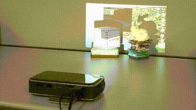

# FullScreen
Display image in fullscreen for the projector-camera system.



Python has some GUI tools, but only a few of them are suitable for fullscreen display. In this repository, *Tkinter* or *OpenCV* or *PyQt5* can be used as the backend. The best backend depends on the environment (i.e., OS, monitor, version of the software), so choose the best one for you.

## Requirement
### Tkinter backend (default)
- Pillow (PIL)

### OpenCV backend (optional)
- OpenCV
- screeninfo (from https://github.com/rr-/screeninfo)

### PyQt5 backend (optional)
- Pillow (PIL) or OpenCV
- PyQt5

## Usage

### Basic imshow
```python
import time
import cv2
from fullscreen import FullScreen

screen = FullScreen()

image = cv2.imread("image/himeji_castle.jpg", 1)

screen.imshow(image)

time.sleep(3)
```

### Get the size of the screen
```python
height, width, ch = screen.shape
```

### Choosing backend
```python
screen = FullScreen(backend="tkinter") # default
```
```python
screen = FullScreen(backend="cv2")
```
```python
screen = FullScreen(backend="PyQt5")
```

## Testing environment
|      | OS | Hardware | Python | Backend |
| ---- | ---- | ---- | ---- | ---- |
|  ✅  | macOS Catalina |  MacBook Pro (13-inch, 2017)  |  3.8  |  Tkinter 8.6.11  |
|  ✅  | macOS Catalina |  MacBook Pro (13-inch, 2017)  |  3.8  |  OpenCV-Python 4.4  |
|  ❌  | macOS Catalina |  MacBook Pro (13-inch, 2017)  |  3.8  |  OpenCV-Python 4.5  |
|  ✅  | macOS Catalina |  MacBook Pro (13-inch, 2017)  |  3.8  |  PyQt5 5.15  |
|  ❌  | macOS BigSur |  MacBook Pro (13-inch, 2017)  |  3.7  |  Tkinter 8.5.9  |
|  ✅  | macOS BigSur |  MacBook Pro (13-inch, 2017)  |  3.9  |  Tkinter 8.6.11  |
|  ❌  | macOS BigSur |  MacBook Pro (13-inch, 2017)  |  3.9  |  OpenCV-Python 4.4  |
|  ❌  | macOS BigSur |  MacBook Pro (13-inch, 2017)  |  3.9  |  OpenCV-Python 4.5  |
|  ❌  | macOS BigSur |  Mac Pro (2019)  |  3.9  |  Tkinter 8.5.9  |
|  ✅  | macOS BigSur |  Mac Pro (2019)  |  3.9  |  Tkinter 8.6.11  |
|  ✅  | macOS BigSur |  Mac Pro (2019)  |  3.8  |  OpenCV-Python 4.4  |
|  ❌  | macOS BigSur |  Mac Pro (2019)  |  3.8  |  OpenCV-Python 4.5  |
|  ✅  | Windows 10 |  ThinkPad (L580)  |  3.9  |  Tkinter 8.6.9  |
|  ✅  | Windows 10 |  ThinkPad (L580)  |  3.9  |  OpenCV-Python 4.4  |
|  ✅  | Windows 10 |  ThinkPad (L580)  |  3.9  |  OpenCV-Python 4.5  |
|  ✅  | Ubuntu 20 (GNOME) |   |  3.8  |  Tkinter 8.6.10 |
|  ✅  | Ubuntu 20 (GNOME) |   |  3.8  |  OpenCV-Python 4.5  |
|  🤔  | Ubuntu 20 (KDE) |   |  3.8  |  Tkinter 8.8.10 |
|  ✅  | Ubuntu 20 (KDE) |   |  3.8  |  OpenCV-Python 4.4  |

Although I have mainly tested on Mac, it should also work on Windows and Ubuntu as the software is cross-platform.

To summarize the above table, the following cases do not seem to work well ❌,
- Tkinter 8.5.9 does not work well on macOS. I think it is related to that [the Apple-supplied Tcl/Tk 8.5 has serious bugs](https://www.python.org/download/mac/tcltk/).
- OpenCV-Python 4.5 does not work well on macOS. I think it is related to that [Qt support has been dropped](https://github.com/opencv/opencv-python/releases/tag/48).

In some cases, it works but may not be perfect 🤔, 
- On Ubuntu, Tkinter could not display the first image, but the second and later images work well.

## ToDo
- Stable support for multiple monitors.
- OpenGL (or Metal?) based fullscreen imshow (like [kamino410/gl_imshow](https://github.com/kamino410/gl_imshow)) on **macOS** for faster rendering.